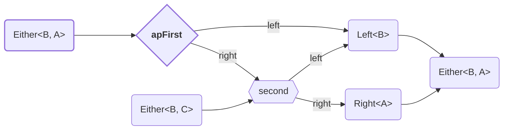
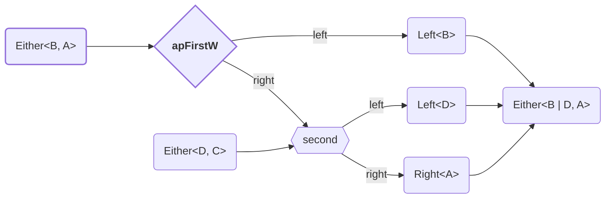
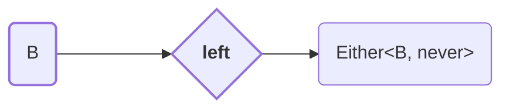
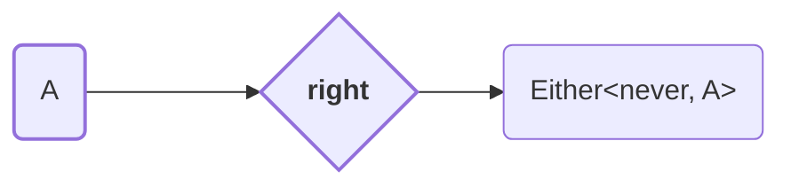
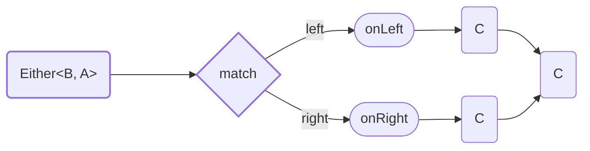
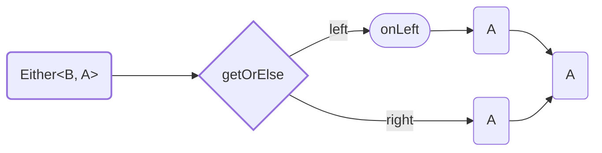
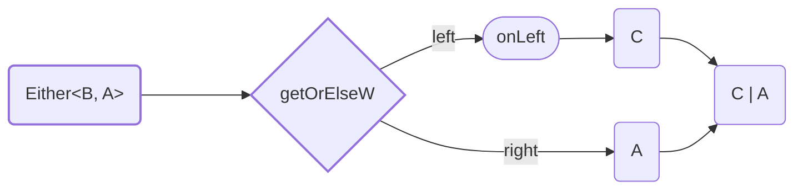

<h1><code>Either</code></h1>

- [combinators](#combinators)
  - [`apFirst`](#apfirst)
  - [`apFirstW`](#apfirstw)
- [constructors](#constructors)
  - [`fromPredicate`](#frompredicate)
  - [`left`](#left)
  - [`right`](#right)
- [destructors](#destructors)
  - [`match` / `fold`](#match--fold)
  - [`matchW` / `foldW`](#matchw--foldw)
  - [`getOrElse`](#getorelse)
  - [`getOrElseW`](#getorelsew)


---


# combinators

## `apFirst`
Combine two effectful actions, keeping only the result of the first.



```ts
import * as E from "fp-ts/lib/Either"
import { pipe } from "fp-ts/lib/function"


type A = number
type B = "error"
type C = string

function value(toggle: boolean): E.Either<B, A> {
    return toggle
        ? E.right(123)
        : E.left("error")
}

function anotherValue(toggle: boolean): E.Either<B, C> {
    return toggle
        ? E.right("abc")
        : E.left("error")
}


const v1: E.Either<B, A> = pipe(
    value(true),
    E.apFirst(
        anotherValue(true)
    )
) // { _tag: 'Right', right: 123 }

const v2: E.Either<B, A> = pipe(
    value(false),
    E.apFirst(
        anotherValue(true)
    )
) // { _tag: 'Left', left: 'error' }

const v3: E.Either<B, A> = pipe(
    value(true),
    E.apFirst(
        anotherValue(false)
    )
) // { _tag: 'Left', left: 'error' }

const v4: E.Either<B, A> = pipe(
    value(false),
    E.apFirst(
        anotherValue(false)
    )
) // { _tag: 'Left', left: 'error' }
```


## `apFirstW`

Less strict version of [apFirst](#apFirst).



```ts
import * as E from "fp-ts/lib/Either"
import { pipe } from "fp-ts/lib/function"


type A = number
type B = "error"
type C = string
type D = "exception"

function value(toggle: boolean): E.Either<B | D, A> {
    return toggle
        ? E.right(123)
        : E.left("error")
}

function anotherValue(toggle: boolean): E.Either<D, C> {
    return toggle
        ? E.right("abc")
        : E.left("exception")
}


const v1: E.Either<B | D, A> = pipe(
    value(true),
    E.apFirstW(
        anotherValue(true)
    )
) // { _tag: 'Right', right: 123 }

const v2: E.Either<B | D, A> = pipe(
    value(false),
    E.apFirstW(
        anotherValue(true)
    )
) // { _tag: 'Left', left: 'error' }

const v3: E.Either<B | D, A> = pipe(
    value(true),
    E.apFirstW(
        anotherValue(false)
    )
) // { _tag: 'Left', left: 'exception' }

const v4: E.Either<B | D, A> = pipe(
    value(false),
    E.apFirstW(
        anotherValue(false)
    ),
    x => x
) // { _tag: 'Left', left: 'error' }
```

---


# constructors
Creates `Either` from value.


## `fromPredicate`


```ts
import * as E from "fp-ts/lib/Either"
import { pipe } from "fp-ts/lib/function"

type A = number
type B = "error"

const v: E.Either<B, A> = pipe(
    123,
    E.fromPredicate(
        (n): boolean => n > 0,
        (n): B => "error"
    )
)
```


## `left`



```ts
import * as E from "fp-ts/lib/Either"

type B = "error"

const v: E.Either<B, never> = E.left("error")
```


## `right`



```ts
import * as E from "fp-ts/lib/Either"

type A = number

const v: E.Either<never, A> = E.right(123)
```


---


# destructors
Gets value from `Either`.


## `match` / `fold`

Method `match` destruct `Either<B, A>` to `C`.

Type of output value can be different from `Left` and `Right`.



```ts
import * as E from "fp-ts/lib/Either"
import { pipe } from "fp-ts/lib/function"

type A = number
type B = "error"
type C = string

function value(toggle: boolean): E.Either<B, A> {
    return toggle
        ? E.right(123)
        : E.left("error")
}

const v1: C = pipe(
    value(true),
    E.fold(
        left => `Left: ${left}`,
        right => `Right: ${right}`,
    )
) // "Right 123"

const v2: C = pipe(
    value(false),
    E.fold(
        left => `Left: ${left}`,
        right => `Right: ${right}`,
    )
) // "Left error"
```


## `matchW` / `foldW`

Method `matchW` destruct `Either<B, A>` to `D | C`. Less strict version of [`match`](#match).

Type of output value can be different from `Left` and `Right`.


```ts
import * as E from "fp-ts/lib/Either"
import { pipe } from "fp-ts/lib/function"

type A = number
type B = "error"
type C = string
type D = null

function value(toggle: boolean): E.Either<B, A> {
    return toggle
        ? E.right(123)
        : E.left("error")
}

const v1: D | C = pipe(
    value(true),
    E.matchW(
        (left): D => null,
        (right): C => `Right: ${right}`,
    )
) // "Right 123"

const v2: D | C  = pipe(
    value(false),
    E.matchW(
        (left): D => null,
        (right): C => `Right: ${right}`,
    )
) // null
```


## `getOrElse`

Method `getOrElse` destruct `Either<B, A>` to `A`.

Type of output value must be same as type of `Right` value.



```ts
import * as E from "fp-ts/lib/Either"
import { pipe } from "fp-ts/lib/function"

type A = number
type B = "error"

function value(toggle: boolean): E.Either<B, A> {
    return toggle
        ? E.right(123)
        : E.left("error")
}

const v1: A = pipe(
    value(true),
    E.getOrElse(
        (err): A => -1
    ),
) // 123

const v2: A = pipe(
    value(false),
    E.getOrElse(
        (err): A => -1
    )
) // -1
```


## `getOrElseW`

Method `getOrElseW` destruct `Either<B, A>` to `A | C`. Less strict version of [`getOrElse`](#getOrElse).

Type of output value can be different from type of `Right` value.



```ts
import * as E from "fp-ts/lib/Either"
import { pipe } from "fp-ts/lib/function"

type A = number
type B = "error"
type C = string

function value(toggle: boolean): E.Either<B, A> {
    return toggle
        ? E.right(123)
        : E.left("error")
}

const v1: C | A = pipe(
    value(true),
    E.getOrElseW(
        (err): C => `My stirng: ${err}`
    ),
) // 123

const v2: C | A = pipe(
    value(false),
    E.getOrElseW(
        (err): C => `My stirng: ${err}`
    ),
) // "My stirng: error"
```