<h1><code>Either</code></h1>

- [instance operations](#instance-operations)
  - [`alt`](#alt)
  - [`altW`](#altw)
- [combinators](#combinators)
  - [`apFirst`](#apfirst)
  - [`apFirstW`](#apfirstw)
  - [`apSecond`](#apsecond)
  - [`apSecondW`](#apsecondw)
- [constructors](#constructors)
  - [`fromPredicate`](#frompredicate)
  - [`left`](#left)
  - [`right`](#right)
- [destructors](#destructors)
  - [`match` / `fold`](#match--fold)
  - [`matchW` / `foldW`](#matchw--foldw)
  - [`getOrElse`](#getorelse)
  - [`getOrElseW`](#getorelsew)


# instance operations

## `alt`

<!-- ## `alt` -->

Identifies an associative operation on a type constructor.
It is similar to `Semigroup`, except that it applies to types of kind `* → *`.

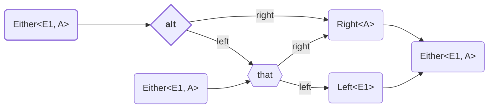


<details>
<summary>Code Example</summary>

```ts
import { Either, left, right, alt } from "fp-ts/lib/Either"
import { pipe } from "fp-ts/lib/function"

type A = number
type E1 = "error"

function value(v: number | null): Either<E1, A> {
    return v !== null
        ? right(v)
        : left("error")
}

const v1: Either<E1, A> = pipe(
    value(123),
    alt(
        () => value(789)
    )
) // { _tag: 'Right', right: 123 }

const v2: Either<E1, A> = pipe(
    value(123),
    alt(
        () => value(null)
    )
) // { _tag: 'Right', right: 123 }

const v3: Either<E1, A> = pipe(
    value(null),
    alt(
        () => value(789)
    )
) // { _tag: 'Right', right: 789 }

const v4: Either<E1, A> = pipe(
    value(null),
    alt(
        () => value(null)
    )
) // { _tag: 'Left', left: 'error' }
```

</details>

---

## `altW`

<!-- ## `altW` -->

Less strict version of [`alt`](#alt).

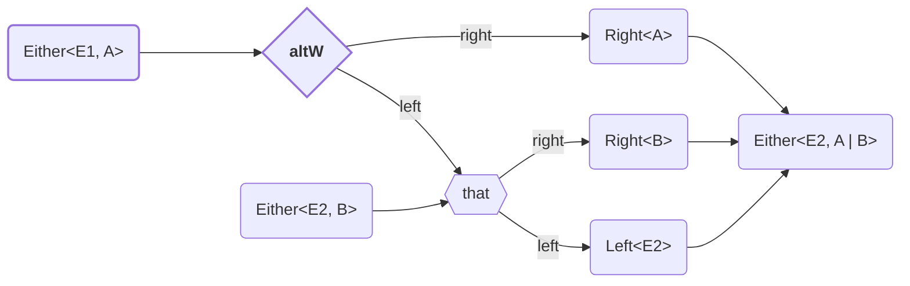

<details>
<summary>Code Example</summary>

```ts
import { Either, left, right, altW } from "fp-ts/lib/Either"
import { pipe } from "fp-ts/lib/function"

type A = number
type B = string
type E1 = "error"
type E2 = "exception"


function value(v: number | null): Either<E1, A> {
    return v !== null
        ? right(v)
        : left("error")
}

function anotherValue(v: string | null): Either<E2, B> {
    return v !== null
        ? right(v)
        : left("exception")
}


const v1: Either<E2, A | B> = pipe(
    value(123),
    altW(
        () => anotherValue("abc")
    )
) // { _tag: 'Right', right: 123 }

const v2: Either<E2, A | B> = pipe(
    value(123),
    altW(
        () => anotherValue(null)
    )
) // { _tag: 'Right', right: 123 }

const v3: Either<E2, A | B> = pipe(
    value(null),
    altW(
        () => anotherValue("xyz")
    )
) // { _tag: 'Right', right: 'xyz' }

const v4: Either<E2, A | B> = pipe(
    value(null),
    altW(
        () => anotherValue(null)
    )
) // { _tag: 'Left', left: 'exception' }
```

</details>

---

# combinators

## `apFirst`

<!-- ## `apFirst` -->

Combine two effectful actions, keeping only the result of the first.

Derivable from `Apply`. <!-- TODO: Add link -->


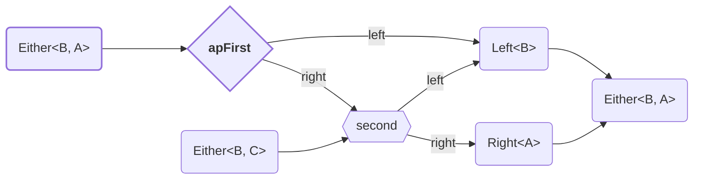

<details>
<summary>Code Example</summary>
  
```ts
import * as E from "fp-ts/lib/Either"
import { pipe } from "fp-ts/lib/function"

type A = number
type B = string
type E1 = "error"

function value(toggle: boolean): E.Either<E1, A> {
    return toggle
        ? E.right(123)
        : E.left("error")
}

function anotherValue(toggle: boolean): E.Either<E1, B> {
    return toggle
        ? E.right("abc")
        : E.left("error")
}

const v1: E.Either<E1, A> = pipe(
    value(true),
    E.apFirst(
        anotherValue(true)
    )
) // { _tag: 'Right', right: 123 }

const v2: E.Either<E1, A> = pipe(
    value(false),
    E.apFirst(
        anotherValue(true)
    )
) // { _tag: 'Left', left: 'error' }

const v3: E.Either<E1, A> = pipe(
    value(true),
    E.apFirst(
        anotherValue(false)
    )
) // { _tag: 'Left', left: 'error' }

const v4: E.Either<E1, A> = pipe(
    value(false),
    E.apFirst(
        anotherValue(false)
    )
) // { _tag: 'Left', left: 'error' }
```
</details>


---

## `apFirstW`

<!-- ## `apFirstW` -->

Less strict version of [apFirst](#apFirst).

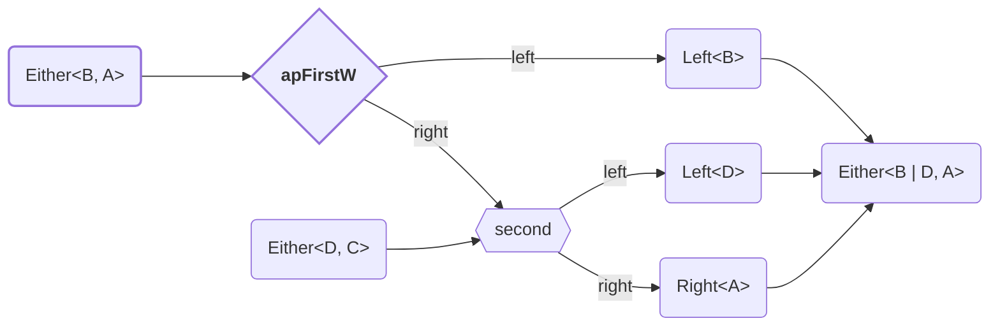

<details>
<summary>Code Example</summary>

```ts
import { Either, left, right, apFirstW } from "fp-ts/lib/Either"
import { pipe } from "fp-ts/lib/function"

type A = number
type B = string
type E1 = "error"
type E2 = "exception"

function value(toggle: boolean): Either<E1 | E2, A> {
    return toggle
        ? right(123)
        : left("error")
}

function anotherValue(toggle: boolean): Either<E2, B> {
    return toggle
        ? right("abc")
        : left("exception")
}

const v1: Either<E1 | E2, A> = pipe(
    value(true),
    apFirstW(
        anotherValue(true)
    )
) // { _tag: 'Right', right: 123 }

const v2: Either<E1 | E2, A> = pipe(
    value(false),
    apFirstW(
        anotherValue(true)
    )
) // { _tag: 'Left', left: 'error' }

const v3: Either<E1 | E2, A> = pipe(
    value(true),
    apFirstW(
        anotherValue(false)
    )
) // { _tag: 'Left', left: 'exception' }

const v4: Either<E1 | E2, A> = pipe(
    value(false),
    apFirstW(
        anotherValue(false)
    )
) // { _tag: 'Left', left: 'error' }
```

</details>

---

## `apSecond`

<!-- ## `apSecond` -->

Combine two effectful actions, keeping only the result of the second.

Derivable from `Apply`. <!-- TODO: Add link -->


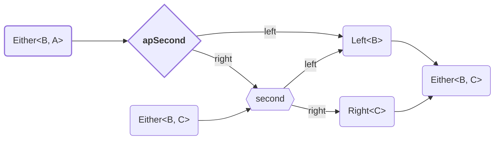

<details>
<summary>Code Example</summary>

```ts
import { Either, left, right, apSecond } from "fp-ts/lib/Either"
import { pipe } from "fp-ts/lib/function"

type A = number
type B = "error"
type C = string

function value(toggle: boolean): Either<B, A> {
    return toggle
        ? right(123)
        : left("error")
}

function anotherValue(toggle: boolean): Either<B, C> {
    return toggle
        ? right("abc")
        : left("error")
}

const v1: Either<B, C> = pipe(
    value(true),
    apSecond(
        anotherValue(true)
    )
) // { _tag: 'Right', right: 'abc' }

const v2: Either<B, C> = pipe(
    value(false),
    apSecond(
        anotherValue(true)
    )
) // { _tag: 'Left', left: 'error' }

const v3: Either<B, C> = pipe(
    value(true),
    apSecond(
        anotherValue(false)
    )
) // { _tag: 'Left', left: 'error' }

const v4: Either<B, C> = pipe(
    value(false),
    apSecond(
        anotherValue(false)
    )
) // { _tag: 'Left', left: 'error' }
```
</details>

---

## `apSecondW`

<!-- ## `apSecondW` -->

Less strict version of (`apSecond`)[#apSecond].

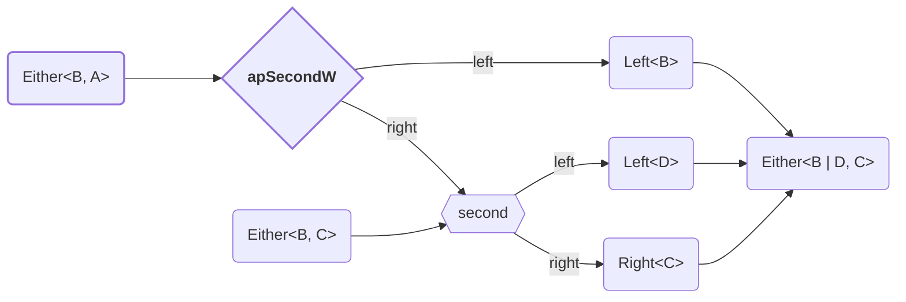

<details>
<summary>Code Example</summary>

```ts
import { Either, left, right, apSecondW } from "fp-ts/lib/Either"
import { pipe } from "fp-ts/lib/function"

type A = number
type B = string
type E1 = "error"
type E2 = "exception"

function value(toggle: boolean): Either<E1 | E2, A> {
    return toggle
        ? right(123)
        : left("error")
}

function anotherValue(toggle: boolean): Either<E2, B> {
    return toggle
        ? right("abc")
        : left("exception")
}

const v1: Either<E1 | E2, B> = pipe(
    value(true),
    apSecondW(
        anotherValue(true)
    )
) // { _tag: 'Right', right: 'abc' }

const v2: Either<E1 | E2, B> = pipe(
    value(false),
    apSecondW(
        anotherValue(true)
    )
) // { _tag: 'Left', left: 'error' }

const v3: Either<E1 | E2, B> = pipe(
    value(true),
    apSecondW(
        anotherValue(false)
    )
) // { _tag: 'Left', left: 'exception' }

const v4: Either<E1 | E2, B> = pipe(
    value(false),
    apSecondW(
        anotherValue(false)
    )
) // { _tag: 'Left', left: 'error' }
```

</details>

---

# constructors
Creates `Either` from value.


## `fromPredicate`

<!-- ## `fromPredicate` -->

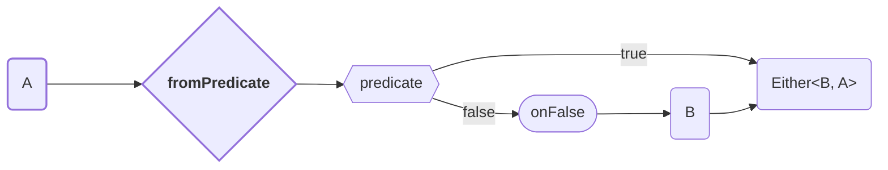

<details>
<summary>Code Example</summary>

```ts
import { Either, fromPredicate } from "fp-ts/lib/Either"
import { pipe } from "fp-ts/lib/function"

type A = number
type E1 = "error"

const v: Either<E1, A> = pipe(
    123,
    fromPredicate(
        (n): boolean => n > 0,
        (n): E1 => "error"
    )
)
```

</details>

---

## `left`

<!-- ## `left` -->

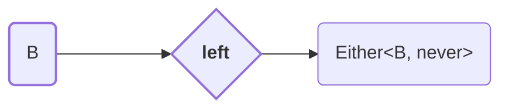

<details>
<summary>Code Example</summary>

```ts
import { Either, left } from "fp-ts/lib/Either"

type E1 = "error"

const v: Either<E1, never> = left("error")
```

</details>

---

## `right`

<!-- ## `right` -->

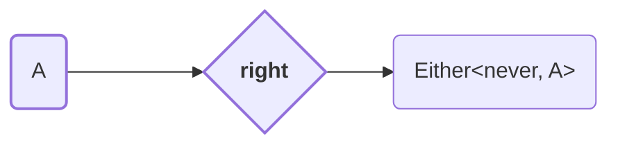

<details>
<summary>Code Example</summary>

```ts
import { Either, right } from "fp-ts/lib/Either"

type A = number

const v: Either<never, A> = right(123)
```
</details>

---

# destructors
Gets value from `Either`.


## `match` / `fold`

<!-- ## `match` / `fold` -->

Method `match` destruct `Either<E1, A>` to `B`.

Type of output value can be different from `Left` and `Right`.

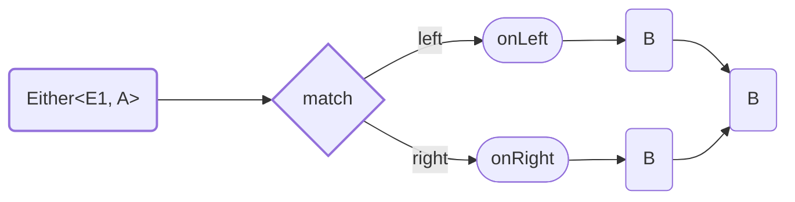

<details>
<summary>Code Example</summary>

```ts
import { Either, left, right, match } from "fp-ts/lib/Either"
import { pipe } from "fp-ts/lib/function"

type A = number
type B = string
type E1 = "error"

function value(toggle: boolean): Either<E1, A> {
    return toggle
        ? right(123)
        : left("error")
}

const v1: B = pipe(
    value(true),
    match(
        left => `Left: ${left}`,
        right => `Right: ${right}`,
    )
) // "Right 123"

const v2: B = pipe(
    value(false),
    match(
        left => `Left: ${left}`,
        right => `Right: ${right}`,
    )
) // "Left error"
```
</details>

---


---

## `matchW` / `foldW`

<!-- ## `matchW` / `foldW` -->

Method `matchW` destruct `Either<B, A>` to `D | C`. Less strict version of [`match`](#match).

Type of output value can be different from `Left` and `Right`.

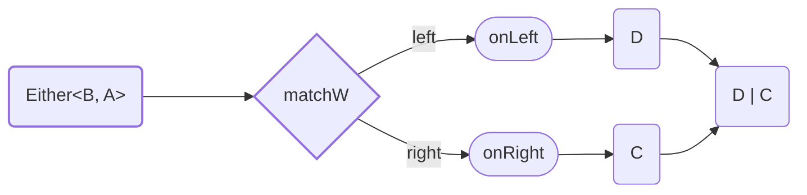

<details>
<summary>Code Example</summary>

```ts
import * as E from "fp-ts/lib/Either"
import { pipe } from "fp-ts/lib/function"

type A = number
type B = "error"
type C = string
type D = null

function value(toggle: boolean): E.Either<B, A> {
    return toggle
        ? E.right(123)
        : E.left("error")
}

const v1: D | C = pipe(
    value(true),
    E.matchW(
        (left): D => null,
        (right): C => `Right: ${right}`,
    )
) // "Right 123"

const v2: D | C  = pipe(
    value(false),
    E.matchW(
        (left): D => null,
        (right): C => `Right: ${right}`,
    )
) // null
```

</details>


---

## `getOrElse`

<!-- ## `getOrElse` -->

Method `getOrElse` destruct `Either<B, A>` to `A`.

Type of output value must be same as type of `Right` value.


<details>
<summary>Code Example</summary>

```ts
import { Either, left, right, getOrElse } from "fp-ts/lib/Either"
import { pipe } from "fp-ts/lib/function"

type A = number
type E1 = "error"

function value(toggle: boolean): Either<E1, A> {
    return toggle
        ? right(123)
        : left("error")
}

const v1: A = pipe(
    value(true),
    getOrElse(
        (err): A => -1
    ),
) // 123

const v2: A = pipe(
    value(false),
    getOrElse(
        (err): A => -1
    )
) // -1
```

</details>

---


---

## `getOrElseW`

<!-- ## `getOrElseW` -->

Method `getOrElseW` destruct `Either<B, A>` to `A | C`. Less strict version of [`getOrElse`](#getOrElse).

Type of output value can be different from type of `Right` value.


<details>
<summary>Code Example</summary>

```ts
import { Either, left, right, getOrElseW } from "fp-ts/lib/Either"
import { pipe } from "fp-ts/lib/function"

type A = number
type B = string
type E1 = "error"

function value(toggle: boolean): Either<E1, A> {
    return toggle
        ? right(123)
        : left("error")
}

const v1: A | B = pipe(
    value(true),
    getOrElseW(
        (err): B => `My stirng: ${err}`
    ),
) // 123

const v2: A | B = pipe(
    value(false),
    getOrElseW(
        (err): B => `My stirng: ${err}`
    ),
) // "My stirng: error"
```

</details>
