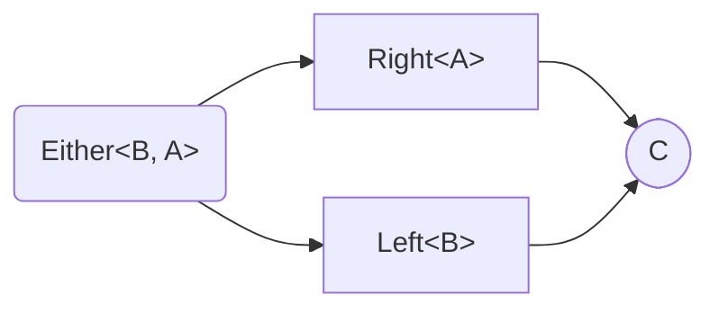
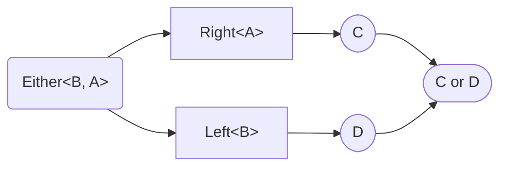

# `Either`

- [`Either`](#either)
  - [Destructors](#destructors)
    - [`fold`](#fold)
    - [`foldW`](#foldw)

## Destructors


### `fold`
*Alias for [`match`](#match).*

Method `fold` destruct `Either<B, A>` to `C`.




```ts
import * as E from "fp-ts/lib/Either";
import { pipe } from "fp-ts/lib/function";

function value(toggle: boolean): E.Either<"error", number> {
    return toggle
        ? E.right(123)
        : E.left("error")
}

pipe(
    value(true),
    E.fold(
        left => `Left: ${left}`,
        right => `Right: ${right}`,
    )
) // "Right 123"

pipe(
    value(false),
    E.fold(
        left => `Left: ${left}`,
        right => `Right: ${right}`,
    )
) // "Left error"
```


### `foldW`
*Alias for [`matchW`](#matchW).*

Method `fold` destruct `Either<B, A>` to `C|D`.




```ts
import * as E from "fp-ts/lib/Either";
import { pipe } from "fp-ts/lib/function";

function value(toggle: boolean): E.Either<"error", number> {
    return toggle
        ? E.right(123)
        : E.left("error")
}

pipe(
    value(true),
    E.foldW(
        left => null,
        right => `Right: ${right}`,
    )
) // "Right 123"

pipe(
    value(false),
    E.foldW(
        left => null,
        right => `Right: ${right}`,
    )
) // null
```