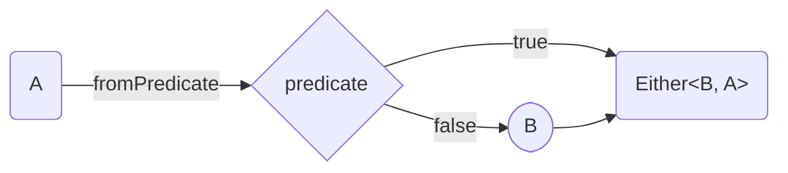
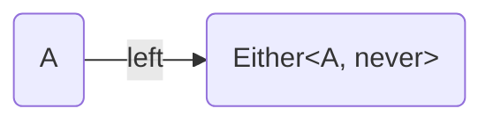
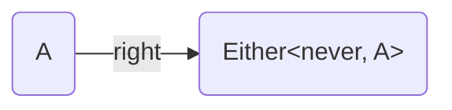

<h1><code>Either</code></h1>

- [constructors](#constructors)
  - [`fromPredicate`](#frompredicate)
  - [`left`](#left)
  - [`right`](#right)
- [destructors](#destructors)
  - [`fold` / `match`](#fold--match)
  - [`foldW` / `matchW`](#foldw--matchw)
  - [`getOrElse`](#getorelse)
  - [`getOrElseW`](#getorelsew)


<!-- ---


# combinators

## `apFirst` -->

---


# constructors
Creates `Either` from value.


## `fromPredicate`





```ts
import * as E from "fp-ts/lib/Either"
import { pipe } from "fp-ts/lib/function"

type A = number
type B = "error"

const v: E.Either<B, A> = pipe(
    123,
    E.fromPredicate(
        (n): boolean => n > 0,
        (n): A => "error"
    )
)
```


## `left`



```ts
import * as E from "fp-ts/lib/Either"

type A = "error"

const v: E.Either<A, never> = E.left("error")
```


## `right`



```ts
import * as E from "fp-ts/lib/Either"

type A = number

const v: E.Either<never, A> = E.right(123)
```


---


# destructors
Gets value from `Either`.


## `fold` / `match`
*Alias for [`match`](#match).*

Method `fold` destruct `Either<B, A>` to `C`.

Type of output value can be different from `Left` and `Right`.


```ts
import * as E from "fp-ts/lib/Either"
import { pipe } from "fp-ts/lib/function"

type A = number
type B = "error"
type C = string

function value(toggle: boolean): E.Either<B, A> {
    return toggle
        ? E.right(123)
        : E.left("error")
}

const v1: C = pipe(
    value(true),
    E.fold(
        left => `Left: ${left}`,
        right => `Right: ${right}`,
    )
) // "Right 123"

const v2: C = pipe(
    value(false),
    E.fold(
        left => `Left: ${left}`,
        right => `Right: ${right}`,
    )
) // "Left error"
```


## `foldW` / `matchW`
*Alias for [`matchW`](#matchW).*

Method `foldW` destruct `Either<B, A>` to `C | D`. Less strict version of [`fold`](#fold).

Type of output value can be different from `Left` and `Right`.


```ts
import * as E from "fp-ts/lib/Either"
import { pipe } from "fp-ts/lib/function"

type A = number
type B = "error"
type C = string
type D = null

function value(toggle: boolean): E.Either<B, A> {
    return toggle
        ? E.right(123)
        : E.left("error")
}

const v1: C | D = pipe(
    value(true),
    E.foldW(
        left => null,
        right => `Right: ${right}`,
    )
) // "Right 123"

const v2: C | D = pipe(
    value(false),
    E.foldW(
        left => null,
        right => `Right: ${right}`,
    )
) // null
```


## `getOrElse`

Method `getOrElse` destruct `Either<B, A>` to `A`.

Type of output value must be same as type of `Right` value.


```ts
import * as E from "fp-ts/lib/Either"
import { pipe } from "fp-ts/lib/function"

type A = number
type B = "error"

function value(toggle: boolean): E.Either<B, A> {
    return toggle
        ? E.right(123)
        : E.left("error")
}

const v1: A = pipe(
    value(true),
    E.getOrElse(
        err => -1
    ),
) // 123

const v2: A = pipe(
    value(false),
    E.getOrElse(
        err => -1
    )
) // -1
```


## `getOrElseW`

Method `getOrElseW` destruct `Either<B, A>` to `A | C`. Less strict version of [`getOrElse`](#getOrElse).

Type of output value can be different from type of `Right` value.


```ts
import * as E from "fp-ts/lib/Either"
import { pipe } from "fp-ts/lib/function"

type A = number
type B = "error"
type C = string

function value(toggle: boolean): E.Either<B, A> {
    return toggle
        ? E.right(123)
        : E.left("error")
}

const v1: A | C = pipe(
    value(true),
    E.getOrElseW(
        err => `My stirng: ${err}`
    ),
) // 123

const v2: A | C = pipe(
    value(false),
    E.getOrElseW(
        err => `My stirng: ${err}`
    ),
) // "My stirng: error"
```