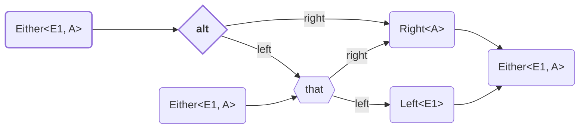

<!-- ## `alt` -->

Identifies an associative operation on a type constructor.
It is similar to `Semigroup`, except that it applies to types of kind `* → *`.




<details>
<summary>Code Example</summary>

```ts
{{./example.ts}}
```

</details>