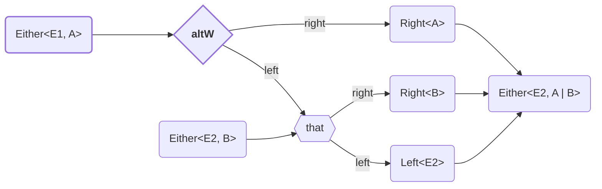

<!-- ## `altW` -->

Less strict version of [`alt`](#alt).


```mermaid
flowchart LR
    style input stroke-width: 2px
    style altW stroke-width: 2px

    input( Either<<span>E1, A</span>> )
    altW{ <b>altW</b> }
    that{{ that }}
    thatInput( Either<<span>E2, B</span>> )
    altWOutputRight( Right<<span>A</span>> )
    thatOutputRight( Right<<span>B</span>> )
    thatOutputLeft( Left<<span>E2</span>> )
    output("Either<<span>E2, A | B</span>>")

    input ---> altW
    altW --> | left | that
    altW --> | right | altWOutputRight
    thatInput --> that
    that --> | left | thatOutputLeft
    that --> | right | thatOutputRight
    thatOutputLeft --> output
    altWOutputRight --> output
    thatOutputRight --> output
```

<details>
<summary>Code Example</summary>

```ts
{{./example.ts}}
```

</details>