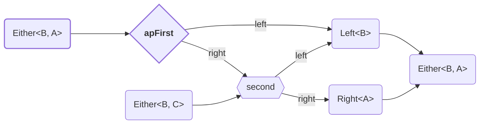

<!-- ## `apFirst` -->

Combine two effectful actions, keeping only the result of the first.

Derivable from `Apply`. <!-- TODO: Add link -->




<details>
<summary>Code Example</summary>
  
```ts
{{./example.ts}}
```
</details>
