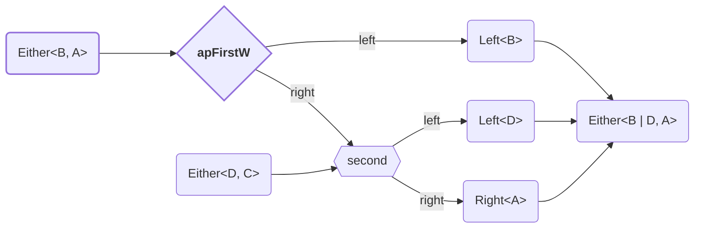

<!-- ## `apFirstW` -->

Less strict version of [apFirst](#apFirst).


```mermaid
flowchart LR
    style input stroke-width: 2px
    style apFirstW stroke-width: 2px

    input( Either<<span>B, A</span>> )
    secondInput( Either<<span>D, C</span>> )
    apFirstW{ <b>apFirstW</b> }
    second{{ second }}
    outputLeft("Left<<span>B</span>>")
    secondOutputLeft("Left<<span>D</span>>")
    secondOutputRight("Right<<span>A</span>>")
    output("Either<<span>B | D, A</span>>")

    second --> | right | secondOutputRight
    apFirstW --> | right | second
    input ---> apFirstW
    secondInput --> second
    apFirstW ---> | left | outputLeft
    second --> | left | secondOutputLeft
    outputLeft --> output
    secondOutputLeft --> output
    secondOutputRight --> output
```

<details>
<summary>Code Example</summary>

```ts
{{./example.ts}}
```

</details>