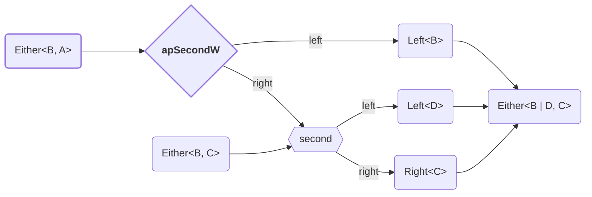

<!-- ## `apSecondW` -->

Less strict version of (`apSecond`)[#apSecond].


```mermaid
flowchart LR
    style input stroke-width: 2px
    style apSecondW stroke-width: 2px

    input( Either<<span>B, A</span>> )
    apSecondW{ <b>apSecondW</b> }
    output("Either<<span>B | D, C</span>>")
    outputLeft("Left<<span>B</span>>")
    secondOutputLeft("Left<<span>D</span>>")
    second{{ second }}
    secondInput( Either<<span>B, C</span>> )
    secondOutputRight("Right<<span>C</span>>")

    input ---> apSecondW
    secondInput --> second
    apSecondW --> | right | second
    apSecondW ---> | left | outputLeft
    second --> | right | secondOutputRight
    second --> | left | secondOutputLeft
    outputLeft --> output
    secondOutputLeft --> output
    secondOutputRight --> output
```

<details>
<summary>Code Example</summary>

```ts
{{./example.ts}}
```

</details>