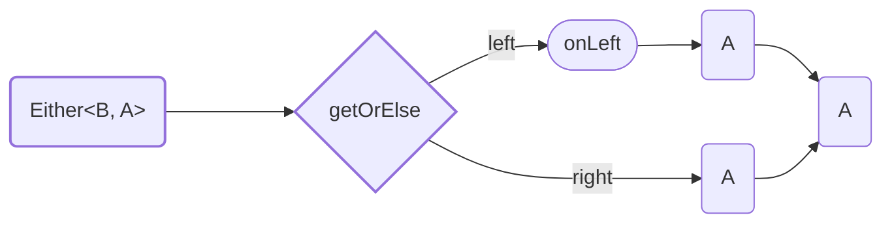

<!-- ## `getOrElse` -->

Method `getOrElse` destruct `Either<B, A>` to `A`.

Type of output value must be same as type of `Right` value.



<details>
<summary>Code Example</summary>

```ts
{{./example.ts}}
```

</details>

---
