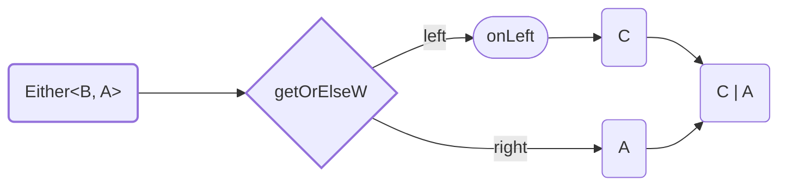

<!-- ## `getOrElseW` -->

Method `getOrElseW` destruct `Either<B, A>` to `A | C`. Less strict version of [`getOrElse`](#getOrElse).

Type of output value can be different from type of `Right` value.



<details>
<summary>Code Example</summary>

```ts
{{./example.ts}}
```

</details>