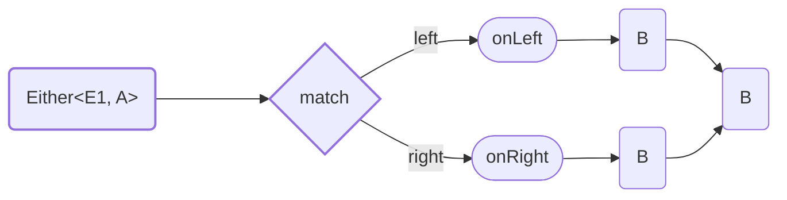

<!-- ## `match` / `fold` -->

Method `match` destruct `Either<E1, A>` to `B`.

Type of output value can be different from `Left` and `Right`.



<details>
<summary>Code Example</summary>

```ts
{{./example.ts}}
```
</details>

---
