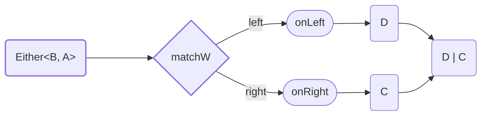

<!-- ## `matchW` / `foldW` -->

Method `matchW` destruct `Either<B, A>` to `D | C`. Less strict version of [`match`](#match).

Type of output value can be different from `Left` and `Right`.



<details>
<summary>Code Example</summary>

```ts
{{./example.ts}}
```

</details>
