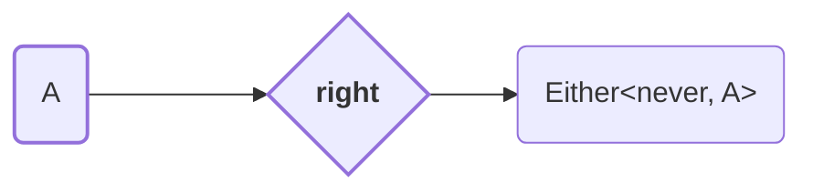

<!-- ## `right` -->


```mermaid
flowchart LR
    style input stroke-width: 2px
    style right stroke-width: 2px

    input("A")
    right{ <b>right<b> }
    output( Either<<span>never, A</span>> )

    input ---> right
    right --> output
```

<details>
<summary>Code Example</summary>

```ts
{{./example.ts}}
```
</details>